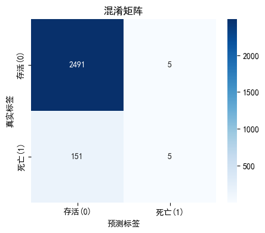

## 项目背景
本项目是一个完整的PICU数据分析项目，旨在通过Python的Pandas、Matplotlib、Seaborn和Scikit-learn库，对PICU数据进行全面的分析和建模，包括数据读取、预处理、可视化、模型构建和评估等环节。

## 核心实现
### 数据读取与探索
```python
#### 导入所需库
import pandas as pd
import numpy as np
import matplotlib.pyplot as plt
import seaborn as sns
from collections import Counter

#### 读取Excel数据文件
path = 'data.xlsx'
picu_data = pd.read_excel(path)

#### 查看数据基本信息
print(picu_data.shape)
print(picu_data.columns)
print(picu_data.isnull().sum())
print(Counter(picu_data["HOSPITAL_EXPIRE_FLAG"]))
```

### 数据探索 - 描述性统计与可视化
```python
print(picu_data.mean())
print(picu_data.median())
print(picu_data.var())

#### 绘制直方图
picu_data.hist(figsize=(12, 8))
plt.suptitle('直方图')
plt.show()
```


```python
#### 绘制箱线图
plt.figure(figsize=(12, 8))
sns.boxplot(data=picu_data)
plt.title('箱线图')
plt.show()
```


### 模型构建
```python
#### 导入机器学习相关模块
from sklearn.model_selection import train_test_split
from sklearn.linear_model import LogisticRegression
from sklearn.impute import SimpleImputer
from sklearn.preprocessing import StandardScaler
from sklearn.metrics import confusion_matrix, roc_auc_score, roc_curve
from sklearn.cluster import KMeans

#### 数据预处理
##### 填充缺失值
imputer = SimpleImputer(strategy='median')
picu_data_imputed = imputer.fit_transform(picu_data)

##### 标准化数据
scaler = StandardScaler()
picu_data_scaled = scaler.fit_transform(picu_data_imputed)

#### 划分训练集和测试集
X_train, X_test, y_train, y_test = train_test_split(picu_data_scaled, picu_data['HOSPITAL_EXPIRE_FLAG'], test_size=0.2, random_state=42)

#### 构建逻辑回归模型
log_reg = LogisticRegression(max_iter=1000, random_state=42)

# 训练模型
log_reg.fit(X_train, y_train)

# 打印模型参数
print("逻辑回归模型参数：\n", log_reg.coef_)

#### 构建随机森林模型
# 创建随机森林模型对象
rf = RandomForestClassifier(n_estimators=100, random_state=42)

# 训练模型
rf.fit(X_train, y_train)

# 打印特征重要性
print("随机森林模型特征重要性：\n", rf.feature_importances_)

#### 构建支持向量机模型
# 创建支持向量机模型对象
svc = SVC(kernel='linear', random_state=42)

# 训练模型
svc.fit(X_train, y_train)

# 打印模型参数
print("支持向量机模型参数：\n", svc.coef_)
```

### 模型评估
逻辑回归模型：准确率最高，但召回率和AUC最低。表明模型在预测存活样本时表现较好，但在预测死亡样本时表现较差。

随机森林模型的准确率和召回率略高于逻辑回归模型，但AUC仍然较低。这表明随机森林模型在预测死亡样本时表现略好于逻辑回归模型，但仍然不理想。

支持向量机模型的准确率最低，但召回率和AUC最高。这表明模型在预测死亡样本时表现较好，但在预测存活样本时表现较差。

三个模型的性能表现各有优劣，主要原因是数据不平衡（死亡样本仅占5.88\%）。如果更关注预测存活样本的准确性，可以选择逻辑回归或随机森林模型；如果更关注预测死亡样本的准确性，可以选择支持向量机模型。

```python
from sklearn.metrics import accuracy_score, recall_score, roc_auc_score

# 逻辑回归模型评估
y_pred_lr = log_reg.predict(X_test)
accuracy_lr = accuracy_score(y_test, y_pred_lr)
recall_lr = recall_score(y_test, y_pred_lr)
roc_auc_lr = roc_auc_score(y_test, y_pred_lr)

# 随机森林模型评估
y_pred_rf = rf.predict(X_test)
accuracy_rf = accuracy_score(y_test, y_pred_rf)
recall_rf = recall_score(y_test, y_pred_rf)
roc_auc_rf = roc_auc_score(y_test, y_pred_rf)

# 支持向量机模型评估
y_pred_svc = svc.predict(X_test)
accuracy_svc = accuracy_score(y_test, y_pred_svc)
recall_svc = recall_score(y_test, y_pred_svc)
roc_auc_svc = roc_auc_score(y_test, y_pred_svc)

# 打印评估结果
print("逻辑回归 - 准确率: {:.4f}, 召回率: {:.4f}, AUC: {:.4f}".format(
    accuracy_lr, recall_lr, roc_auc_lr))
print("随机森林 - 准确率: {:.4f}, 召回率: {:.4f}, AUC: {:.4f}".format(
    accuracy_rf, recall_rf, roc_auc_rf))
print("支持向量机 - 准确率: {:.4f}, 召回率: {:.4f}, AUC: {:.4f}".format(
    accuracy_svc, recall_svc, roc_auc_svc))
```


#### 绘制混淆矩阵
```python
# 打印模型参数
print("逻辑回归模型参数：\n", log_reg.coef_)
# 预测测试集的概率值
# predict_proba()返回每个样本属于各个类别的概率
# [:, 1]选择属于正类（死亡）的概率
# y_pred_prob将用于ROC曲线和混淆矩阵的计算

# 1. 用实际训练好的模型计算预测概率
# 对测试集预测为“死亡(1)”的概率
y_pred_prob = log_reg.predict_proba(X_test)[:, 1]

# 2. 定义绘制混淆矩阵的函数
def confusion_matrix_plot(y_true, y_pred_prob, threshold=0.5, title='混淆矩阵'):
    """
    绘制混淆矩阵热力图的函数

    参数说明：
    y_true：真实标签数组
    y_pred_prob：模型预测的正类（1：死亡）概率数组
    threshold：分类阈值，默认0.5
    title：图表标题
    """
    # 将概率转换为二分类预测标签（0/1）
    y_pred = (y_pred_prob > threshold).astype(int)
    
    # 计算混淆矩阵
    cm = confusion_matrix(y_true, y_pred)
    
    # 创建图形和坐标轴
    fig, ax = plt.subplots(figsize=(5, 4))
    
    # 绘制热力图
    sns.heatmap(cm, annot=True, fmt='d', cmap='Blues', ax=ax)
    
    # 设置坐标轴和标题
    ax.set_xlabel('预测标签')
    ax.set_ylabel('真实标签')
    ax.set_title(title)
    ax.xaxis.set_ticklabels(['存活(0)', '死亡(1)'])
    ax.yaxis.set_ticklabels(['存活(0)', '死亡(1)'])
    
    plt.show()

# 3. 调用函数绘制混淆矩阵热力图

confusion_matrix_plot(y_true=y_test, y_pred_prob=y_pred_prob, threshold=0.5)

```


```python
# 创建随机森林模型对象
rf = RandomForestClassifier(n_estimators=100, random_state=42)

# 训练模型
rf.fit(X_train, y_train)

# 打印特征重要性
print("随机森林模型特征重要性：\n", rf.feature_importances_)

# 1. 用随机森林模型计算测试集预测概率（预测为死亡=1 的概率）
y_pred_prob_rf = rf.predict_proba(X_test)[:, 1]

# 2. 定义/复用混淆矩阵绘图函数（如果之前已经定义过，就不用重复写）
from sklearn.metrics import confusion_matrix
import seaborn as sns
import matplotlib.pyplot as plt

def confusion_matrix_plot(y_true, y_pred_prob, threshold=0.5, title='混淆矩阵'):
    """
    绘制混淆矩阵热力图
    """
    # 概率转为0/1预测标签
    y_pred = (y_pred_prob > threshold).astype(int)
    
    # 计算混淆矩阵
    cm = confusion_matrix(y_true, y_pred)
    
    # 画热力图
    fig, ax = plt.subplots(figsize=(5, 4))
    sns.heatmap(cm, annot=True, fmt='d', cmap='Blues', ax=ax)
    ax.set_xlabel('预测标签')
    ax.set_ylabel('真实标签')
    ax.set_title(title)
    ax.xaxis.set_ticklabels(['存活(0)', '死亡(1)'])
    ax.yaxis.set_ticklabels(['存活(0)', '死亡(1)'])
    plt.show()

# 3. 调用函数，专门给“随机森林”加一个标题
confusion_matrix_plot(y_true=y_test, 
                      y_pred_prob=y_pred_prob_rf, 
                      threshold=0.5, 
                      title='随机森林模型 混淆矩阵')
```


```python
###支持向量机
print("步骤1: 检查数据是否存在...")
print("X_train 是否存在:", 'X_train' in dir())
print("y_train 是否存在:", 'y_train' in dir())
print("X_test 是否存在:", 'X_test' in dir())
print("y_test 是否存在:", 'y_test' in dir())

if 'X_train' in dir() and 'y_train' in dir():
    print("步骤4: 数据存在，开始创建模型...")
    svc = SVC(kernel='linear', probability=True, random_state=42)
    print("步骤5: 模型创建成功")
else:
    print("错误: 缺少训练数据！")

print("步骤2: 正在fit模型，这可能需要一些时间...")
svc.fit(X_train, y_train)
print("步骤3: 模型训练完成")

# 2. 预测概率
print("步骤4: 开始预测概率...")
y_pred_prob_svc = svc.predict_proba(X_test)[:, 1]
print("步骤5: 概率预测完成")

# 调试：打印一些基本信息
print("步骤6: 检查数据...")
print("y_test 形状:", y_test.shape)
print("y_pred_prob_svc 形状:", y_pred_prob_svc.shape)
print("y_test 唯一值:", np.unique(y_test))
print("y_pred_prob_svc 范围:", y_pred_prob_svc.min(), "到", y_pred_prob_svc.max())

# 3. 按阈值转换为预测标签
print("步骤7: 转换预测标签...")
y_pred_svc = (y_pred_prob_svc > 0.5).astype(int)
print("y_pred_svc 唯一值:", np.unique(y_pred_svc))

# 4. 计算混淆矩阵
print("步骤8: 计算混淆矩阵...")
cm = confusion_matrix(y_test, y_pred_svc)
print("混淆矩阵:\n", cm)
print("混淆矩阵形状:", cm.shape)

# 5. 绘制热力图
print("步骤9: 开始绘图...")
try:
    fig, ax = plt.subplots(figsize=(6, 5))
    print("步骤10: 创建图形成功")
    
    sns.heatmap(cm, annot=True, fmt='d', cmap='Blues', ax=ax, cbar=True)
    print("步骤11: 绘制热力图成功")
    
    ax.set_xlabel('预测标签')
    ax.set_ylabel('真实标签')
    ax.set_title('支持向量机模型 混淆矩阵')
    ax.set_xticks([0.5, 1.5])
    ax.set_yticks([0.5, 1.5])
    ax.set_xticklabels(['存活(0)', '死亡(1)'])
    ax.set_yticklabels(['存活(0)', '死亡(1)'])
    print("步骤12: 设置标签成功")
    
    plt.tight_layout()
    print("步骤13: 调整布局成功")
    
    plt.show()
    print("步骤14: 显示图形完成 - 绘图完成！")
except Exception as e:
    print(f"绘图出错: {e}")
    import traceback
    traceback.print_exc()
```


#### 绘制ROC曲线
```python
models = {
    '逻辑回归': {'prob': y_pred_prob},  # 或者 y_pred_prob_log
    '随机森林': {'prob': y_pred_prob_rf},
    '支持向量机': {'prob': y_pred_prob_svc}
}
from sklearn.metrics import roc_curve, roc_auc_score
import matplotlib.pyplot as plt

plt.figure(figsize=(8, 6))

for name, model in models.items():
    fpr, tpr, _ = roc_curve(y_test, model['prob'])
    auc = roc_auc_score(y_test, model['prob'])
    plt.plot(fpr, tpr, lw=2, label=f'{name}(AUC = {auc:.3f})')

# 绘制参考线（随机分类器）
plt.plot([0, 1], [0, 1], 'k--', lw=2, label='随机分类器 (AUC = 0.500)')

# 设置图表属性
plt.xlim([0.0, 1.0])
plt.ylim([0.0, 1.05])
plt.xlabel('假阳性率 (1 - Specificity)')
plt.ylabel('真阳性率 (Sensitivity)')
plt.title('三种模型ROC曲线对比')
plt.legend(loc="lower right")
plt.grid(True, alpha=0.3)
plt.show()
```


### 模型解释性分析
逻辑回归：

```python
import shap

explainer_lr = shap.LinearExplainer(log_reg, X_train)
shap_values_lr = explainer_lr(X_train)

shap.summary_plot(shap_values_lr, X_train)

shap.summary_plot(shap_values_lr, X_train, plot_type="bar")

shap.dependence_plot('lab_5235_max', shap_values_lr.values, X_train)
```


特征重要性：
最重要的特征是lab_5257_min（最低血氧饱和度），对死亡风险预测的贡献最大。
其他重要特征包括lab_5225_range（血氧饱和度范围）、lab_5235_max（最大乳酸值）和lab_5227_min（最低呼吸频率）。


SHAP值分布：
lab_5257_min的SHAP值分布较广，表明对预测结果的影响较大。
lab_5225_range的SHAP值分布较广，表明对预测结果的影响较大。


依赖图：
lab_5235_max的SHAP值随着其值的增加而增加，表明乳酸值越高，死亡风险越高。
lab_5237_min的SHAP值随着其值的增加而减少，表明pH值越高，死亡风险越低。


```python
print("X_train 形状:", X_train.shape)  

# 计算 SHAP
explainer_rf = shap.TreeExplainer(rf)
shap_values_rf = explainer_rf(X_train)
print("原始 shap_values_rf.shape:", shap_values_rf.values.shape)  

# 只取正类(1)的 SHAP 值：形状变成 (n_samples, n_features)
sv = shap_values_rf.values[:, :, 1]
print("用于画图的 sv.shape:", sv.shape)

# Beeswarm
shap.summary_plot(sv, X_train, feature_names=X_train.columns)

# Bar 图
shap.summary_plot(sv, X_train, plot_type="bar", feature_names=X_train.columns)

# 依赖图
shap.dependence_plot('lab_5235_max', sv, X_train, feature_names=X_train.columns)
```


随机森林模型

特征重要性：
最重要的特征是lab_5257_min（最低血氧饱和度），对死亡风险预测的贡献最大;
其他重要特征包括lab_5237_min（最低pH值）、age_month（月龄）和lab_5235_max（最大乳酸值）

SHAP值分布：
lab_5257_min的SHAP值分布较广，表明对预测结果的影响较大;
lab_5237_min的SHAP值分布较广，表明对预测结果的影响较大
    
依赖图：
lab_5235_max的SHAP值随着其值的增加而增加，表明乳酸值越高，死亡风险越高;
age_month的SHAP值随着月龄的增加而增加，表明月龄越大，死亡风险越高


```python
# 为加速，背景数据抽样了一部分
background = shap.sample(X_train, 100)  
explainer_svc = shap.KernelExplainer(svc.predict_proba, background)
shap_values_svc = explainer_svc(X_train, l1_reg="aic")  
shap_values_svc = shap_values_svc[:,:,1]

# 蜂群图
shap.summary_plot(shap_values_svc, X_train)

# 条形图
shap.summary_plot(shap_values_svc, X_train, plot_type="bar")

# 依赖图
shap.dependence_plot('lab_5235_max', shap_values_svc.values, X_train)
```


支持向量机模型

特征重要性：
最重要的特征是lab_5257_min（最低血氧饱和度），对死亡风险预测的贡献最大
其他重要特征包括lab_5227_min（最低呼吸频率）、lab_5225_range（血氧饱和度范围）和lab_5235_max（最大乳酸值）

SHAP值分布：
lab_5257_min的SHAP值分布较广，表明对预测结果的影响较大
lab_5227_min的SHAP值分布较广，表明对预测结果的影响较大
    
依赖图：
lab_5235_max的SHAP值随着其值的增加而增加，表明乳酸值越高，死亡风险越高
lab_5237_min的SHAP值随着其值的增加而减少，表明pH值越高，死亡风险越低


综合比较

特征重要性：三个模型的特征重要性排序基本一致，lab_5257_min是最重要的特征

SHAP值分布：三个模型的SHAP值分布基本一致，lab_5257_min的SHAP值分布较广，表明对预测结果的影响较大

依赖图：三个模型的依赖图基本一致，lab_5235_max的SHAP值随着其值的增加而增加，表明乳酸值越高，死亡风险越高


结论

特征重要性：lab_5257_min（最低血氧饱和度）是预测死亡风险的最重要特征

SHAP值分布：lab_5257_min的SHAP值分布较广，表明对预测结果的影响较大

依赖图：lab_5235_max的SHAP值随着其值的增加而增加，表明乳酸值越高，死亡风险越高


